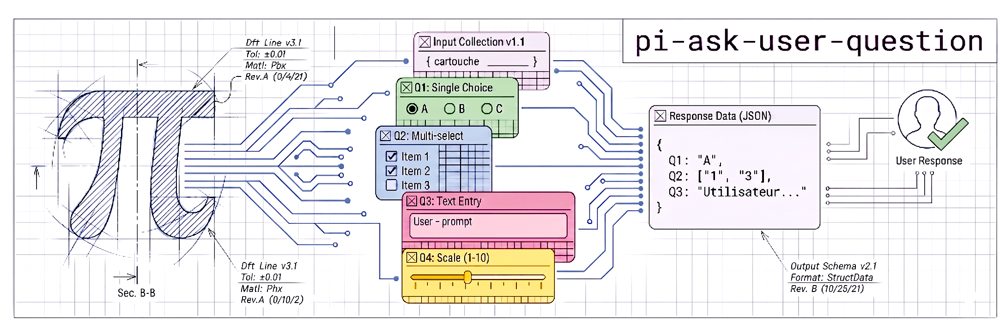

<p align="center">
  <picture>
    <source media="(prefers-color-scheme: dark)" srcset="docs/assets/banner.dark.png" />
    <source media="(prefers-color-scheme: light)" srcset="docs/assets/banner.light.png" />
    
  </picture>
</p>

<h1 align="center">pi-aks-user-question</h1>

<p align="center">
  A pi extension that lets LLMs ask structured questions to users via an interactive TUI form.
</p>

<p align="center">
  <a href="./docs/architecture.md">Architecture</a> ·
  <a href="./docs/schema.md">Schema reference</a> ·
  <a href="./docs/ui.md">UI spec</a>
</p>

---

- [Why](#why)
- [Features](#features)
- [Install](#install)
- [Question types](#question-types)
- [Usage](#usage)
- [Project layout](#project-layout)
- [Development](#development)
- [License](#license)

---

<p align="center">
  
</p>

---

## Why

When an LLM needs user input, it typically asks a plain-text question and waits for a free-form reply. This works for simple follow-ups but quickly breaks down when the agent needs structured data — picking from a set of options, entering validated URLs, confirming a yes/no, or answering multiple related questions at once.

`pi-aks-user-question` solves this with a single tool call. The LLM describes the questions it needs answered as JSON parameters; the extension renders an interactive TUI form with keyboard navigation, inline validation, and a review screen. The user's typed answers flow back as structured data the LLM can act on immediately.

No free-form parsing. No follow-up clarifications. One call, structured answers.

## Features

- **5 question types** — text, number, choice (single-select), multichoice (multi-select), and boolean.
- **Inline validation** — 8 built-in formats (URL, email, IP, IPv4, IPv6, number, integer, regex) with debounced feedback on text inputs.
- **Tab navigation** — each question gets its own tab; overflow is handled with an expand-from-active algorithm and ellipsis indicators.
- **Review screen** — summary of all answers with warnings for unanswered required questions. Submit or go back to edit.
- **Visual slider** — number inputs display a range slider when both `min` and `max` are set.
- **"Other…" free-text** — choice and multichoice questions append an "Other…" row by default (opt-out with `allowOther: false`).
- **Customizable boolean** — labels ("Yes"/"No") and colors (green/red) are overridable per question.
- **Keyboard-first** — Tab/Shift+Tab to navigate, Space to select, Enter to advance, Esc to quit.

## Install

```sh
pi install npm:@axnic/pi-aks-user-question
```

Restart pi. The extension registers the `ask_user_question` tool on startup.

## Question types

| Type          | Widget                                                | Value type |
| ------------- | ----------------------------------------------------- | ---------- |
| `text`        | Single-line editor with optional format validation    | `string`   |
| `number`      | Numeric field with ↑/↓ step and optional range slider | `number`   |
| `choice`      | Numbered list — Space picks one, Enter advances       | `string`   |
| `multichoice` | Checkbox list — Space toggles, Enter advances         | `string[]` |
| `boolean`     | Yes/No toggle — ↑/↓ or Y/N to switch                  | `boolean`  |

## Usage

The LLM calls `ask_user_question` with a `questions` array. Each question specifies a `type`, `question` text, a short `header` for the tab label, and type-specific fields.

### Example — mixed question types

```json
{
  "questions": [
    {
      "id": "runtime",
      "type": "choice",
      "question": "Which runtime do you target?",
      "header": "Runtime",
      "options": [
        {
          "label": "Node.js",
          "description": "V8-based, most ecosystem support"
        },
        {
          "label": "Deno",
          "description": "Secure by default, built-in TypeScript"
        },
        { "label": "Bun", "description": "Fast startup, bundler included" }
      ],
      "allowOther": false
    },
    {
      "id": "port",
      "type": "number",
      "question": "Which port?",
      "header": "Port",
      "required": true,
      "validation": { "format": "integer", "min": 1, "max": 65535 }
    },
    {
      "id": "enable-tls",
      "type": "boolean",
      "question": "Enable TLS?",
      "header": "TLS",
      "defaultValue": true
    },
    {
      "id": "api-url",
      "type": "text",
      "question": "What is the API endpoint?",
      "header": "Endpoint",
      "placeholder": "e.g. https://api.example.com",
      "validation": { "format": "url", "protocols": ["https"] }
    }
  ]
}
```

The form returns structured answers keyed by `id`:

```json
{
  "runtime": "Deno",
  "port": 8080,
  "enable-tls": true,
  "api-url": "https://api.example.com"
}
```

## Project layout

```text
pi-aks-user-question/
├── index.ts              Extension entry point — registers the tool
├── src/
│   ├── schema.ts         TypeBox schemas for tool parameter validation
│   ├── types.ts          Shared TypeScript interfaces
│   ├── validation.ts     Text/number input validators (8 formats)
│   ├── helpers.ts        Stateless utilities (errorResult, stripAnsi, …)
│   └── form/
│       ├── index.ts      Form factory — wires questions to inputs
│       ├── form.ts       Form class — orchestrates lifecycle
│       ├── tabs.ts       Tab bar with overflow handling
│       ├── review.ts     Review screen with scrollable summary
│       ├── question.ts   FormQuestion interface
│       ├── scrollbar.ts  Shared scrollbar character utility
│       └── inputs/
│           ├── types.ts    Input/BaseInput abstractions
│           ├── text.ts     TextInput — single-line with validation
│           ├── number.ts   NumberInput — numeric with slider
│           ├── boolean.ts  BooleanInput — yes/no toggle
│           └── choice.ts   ChoiceInput — single and multi-select
├── docs/
│   ├── architecture.md   Module interaction and data flow
│   ├── schema.md         JSON Schema reference and design decisions
│   ├── schema.json       Machine-readable tool parameter schema (generated)
│   └── ui.md             TUI layout spec: tab bar, colors, review, footer
├── scripts/
│   └── generate-schema.ts  Generates docs/schema.json from TypeBox
└── vitest.config.ts         Test configuration
```

## Development

All dev tooling is managed via [mise](https://mise.run).

```sh
# Setup (run once after clone)
mise trust && mise install
pnpm install

# Common commands
pnpm test                # run vitest suite
mise run build           # bundle extension → dist/index.js
mise run lint            # run Trunk (check only)
mise run lint:fix        # auto-fix lint issues
mise run docs:schema     # regenerate docs/schema.json from code
```

See [AGENTS.md](./AGENTS.md) for architecture details, commit conventions, and coding guidelines.

## License

Apache 2.0

---

<sup>This project was vibe-coded with AI assistance and reviewed by the maintainer before publishing.</sup>
