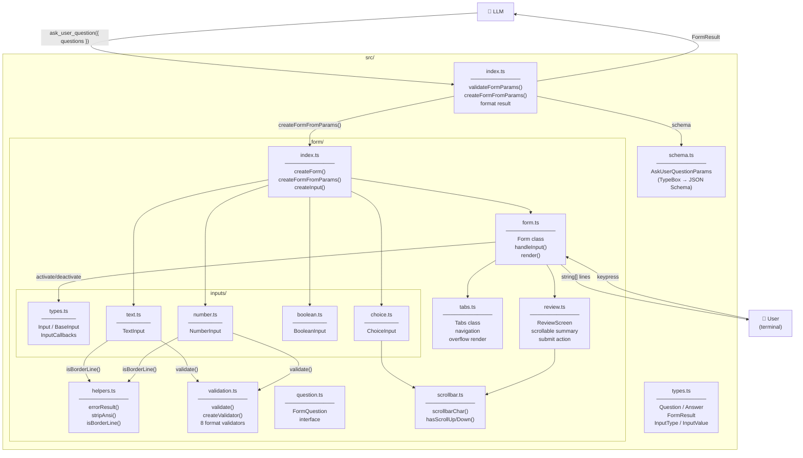

# Architecture

## Module map

```text
index.ts            Extension entry point — registers the tool, validates params, formats result
src/
├── schema.ts       TypeBox schemas for tool parameter validation + JSON Schema generation
├── types.ts        Shared TypeScript interfaces (Question, Answer, FormResult, …)
├── helpers.ts      Pure stateless utilities (errorResult, stripAnsi, isBorderLine)
├── validation.ts   Text/number input validators (8 formats: url, email, ip, ipv4, ipv6, number, integer, regex)
└── form/
    ├── index.ts    Form factory: validateFormParams(), createForm(), createFormFromParams()
    ├── form.ts     Form class: keyboard delegation, input lifecycle, frame rendering
    ├── tabs.ts     Tabs class: tab bar state, navigation, overflow rendering
    ├── review.ts   ReviewScreen class: scrollable answer summary, submit action
    ├── question.ts FormQuestion interface linking Question → Input
    ├── scrollbar.ts  Shared scrollbar character utility (thumb/track)
    └── inputs/
        ├── types.ts    Input/BaseInput/InputCallbacks/RenderContext abstractions
        ├── text.ts     TextInput: single-line editor, debounced validation, placeholder
        ├── number.ts   NumberInput: numeric editor, insert-then-revert, slider
        ├── boolean.ts  BooleanInput: vertical yes/no toggle (no Editor)
        └── choice.ts   ChoiceInput: single-select and multi-select with Other… row
```

## File interactions



`schema.ts` imports from `validation.ts` (for string/numeric validation sub-schemas), and `types.ts` imports TypeBox static types from `schema.ts`. These two, along with `validation.ts`, form the base of the dependency graph.

`form/` has no dependency on `index.ts`: it is a self-contained TUI controller that only knows about questions, an Editor, and a `done()` callback.

## Call sequence

What happens from the moment the LLM calls `ask_user_question` to the moment it gets an answer:

```text
LLM                  index.ts              form/               Terminal
 │                      │                     │                    │
 │─ ask_user_question ─►│                     │                    │
 │                      ├─ validateFormParams()│                   │
 │                      ├─ ctx.ui.custom() ──►│                    │
 │                      │                     ├─ createForm()      │
 │                      │                     ├─ new Editor()      │
 │                      │                     ├─ createInput() ×N  │
 │                      │                     ├─ new Form()        │
 │                      │                     ├─ new Tabs()        │
 │                      │                     ├─ new ReviewScreen()│
 │                      │                     ├─ render() ────────►│  (initial)
 │                      │                     │                    │
 │                      │                     │◄── keypress ───────│
 │                      │                     ├─ Form.handleInput()│
 │                      │                     │  ├─ input.handle() │
 │                      │                     │  ├─ tabs.handle()  │
 │                      │                     │  └─ invalidate()   │
 │                      │                     ├─ render() ────────►│  (re-render)
 │                      │                     │      ...           │
 │                      │                     │◄── Enter (review) ─│
 │                      │                     ├─ collectAndFinish()│
 │                      │◄─ done(FormResult) ─│                    │
 │                      ├─ format answers     │                    │
 │◄─ structured JSON ───│                     │                    │
```

## Data flow inside `form/`

The form follows a strict unidirectional loop — no component reaches back into another:

```text
Form.handleInput(keypress)
    │
    ├─ Exit confirm?  → Y/Enter=quit, N=dismiss
    │
    ├─ input.handleInput()  → returns true if consumed
    │   ├── mutates input state (value, cursor, selection)
    │   └── calls callbacks (onAdvance, onRetreat, onRefresh)
    │
    ├─ reviewScreen.handleInput()  → "submit" | "scrolled" | null
    │
    ├─ tabs.handleInput()  → Tab/Shift+Tab consumed
    │   └── onTabChange → deactivate old input, activate new input
    │
    └─ Escape → show exit confirm
    │
    ▼
_refresh()
    ├── clear render cache
    └── requestRender()
         │
         ▼
    Form.render(width)
         ├── tabs.render()         (tab bar)
         ├── _renderInputFrame()   (question + widget + error + hints)
         │   └── input.renderWidget(ctx)
         ├── reviewScreen.render() (or)
         └── _renderExitConfirm()  (or)
         │
         ▼
    string[] → terminal
```

## Key design decisions

**Why `form/` is isolated from `index.ts`**
`createForm()` takes `questions`, `tui`, `theme`, and `done()` — nothing from the extension API. This means the form can be tested or reused without the pi tool runtime.

**Why render caching (`_cachedLines` / `_cachedWidth`)**
The TUI calls `render()` on every terminal event (resize, focus, …), not just on user input. Caching the rendered lines and invalidating on state change avoids redundant work on idle events. The cache is also invalidated when the terminal width changes.

**Why deferred callbacks in `createForm()`**
Inputs need `InputCallbacks` at construction time, but callbacks point to Form methods — and Form needs inputs to exist first. The solution is stub callbacks that are overwritten with real ones after Form instantiation, breaking the circular dependency cleanly.

**Why a single `ChoiceInput` handles both `choice` and `multichoice`**
The rendering and keyboard handling is nearly identical. A `_multi` boolean flag controls the three differences: selection behaviour (clear+pick vs toggle), deselection (blocked vs allowed), and return type (`string` vs `string[]`).

**Why `BooleanInput` does not use the shared `Editor`**
A yes/no toggle has no text to edit — only two states. Using the Editor would add complexity with no benefit. BooleanInput manages its own `_value` and `_answered` state directly.

**Why insert-then-revert in `NumberInput`**
Instead of pre-filtering keypresses (which would require reimplementing cursor logic), the input forwards the character to the Editor, checks if the resulting text is a valid number prefix, and undoes the insertion if it is not. This keeps the Editor as the single source of truth for buffer and cursor state.
